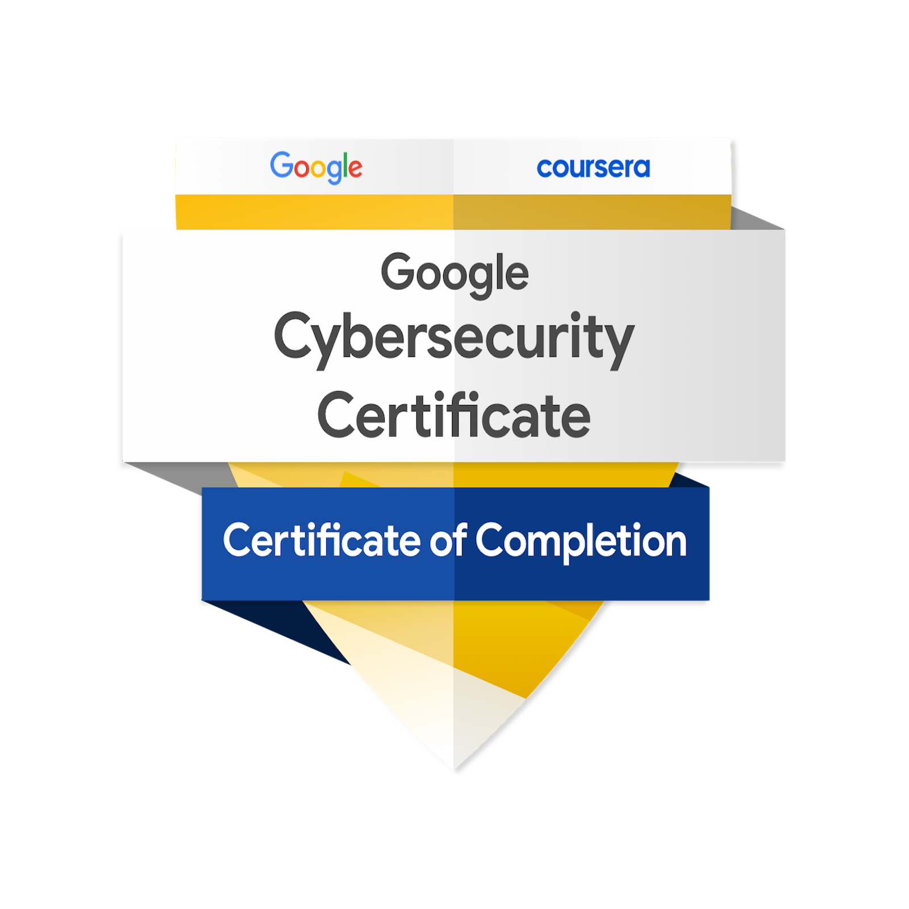

# Certification Section

Welcome to the Certification Section of my GitHub repository. Here, you will find the certifications and credentials related to my achievements in cybersecurity.

## Certificates

I have obtained several certifications, which are available for download in this section. Each certificate is provided in PDF format.

1. [Certificate 01](./01.pdf)
2. [Certificate 02](./02.pdf)
3. [Certificate 03](./03.pdf)
4. [Certificate 04](./04.pdf)
5. [Certificate 05](./05.pdf)
6. [Certificate 06](./06.pdf)
7. [Certificate 07](./07.pdf)
8. [Certificate 08](./08.pdf)

## Specialization Certificate

- [Specialization Certificate](./Specialization%20Certificate.pdf)

## Google Cybersecurity Certification

- [Google Cybersecurity Certificate Badge](https://www.credly.com/badges/dca2db92-f4dd-4bdd-a305-5ce9a3ad70ca/public_url)
- [Google Cybersecurity Specialization Certificate](https://coursera.org/share/e149e0d72981a12c6642055ce1d8a554)

## Badge

- 

Feel free to download and review the certificates to verify my qualifications and achievements.

---
For any inquiries or further information, please [contact me](https://www.linkedin.com/in/mansoor-bukhari-77549a264/).
